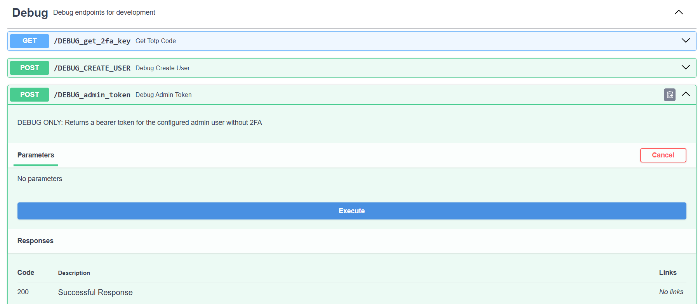
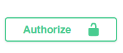

## Assignment 3

### How to run project
#### Setup
Install uv package manager, [instructions here](https://docs.astral.sh/uv/getting-started/installation/)

#### For Production
`uv run init.py`
#### For Development (Hot-reload)
`uv run uvicorn init:app --reload`\
Note: Swagger api page is available at the `\docs` endpoint

#### Using Fastapi Dev
`uv run fastapi dev`
Works due to fastapi entrypoint override in pyproject.toml

To see docs go to (http://127.0.0.1:8000/docs) after running

#### Usage
Click on the debug_admin_token function and execute, you will get an access token back. Copy it.

Click on the Authorize button on the top right of the page and paste the copy pasted value.\
\
You should be logged in now  👍 \
Try it on the get users endpoint and you should get detailed results\